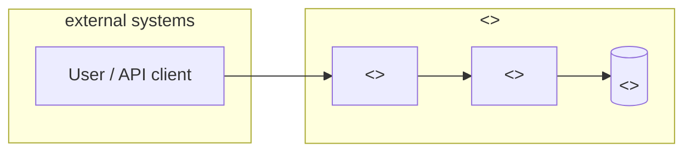

# <<PROJECT_NAME>>

> ## ✅ TESTED AND TRANSFERRED
> This repository has been consolidated to the canonical ECHO account.
> - **New location**: https://github.com/echoomegaprime/echo-repo-template
> - **Destination commit**: `79b798244c8e1925c8a26767bc884459be3ed436`
> - **Cert Forge certificate**: `cert_7c087e48288bb57e5586d12f52e2fafe4bd90e54` (`PRODUCTION_READY`)
> - **GitHub App Suite**: manual receipt (blocked by build #29466) — see
>   [`.echo/repo-health.md`](https://github.com/echoomegaprime/echo-repo-template/blob/main/.echo/repo-health.md)
>   in the new repository
> - **Transfer date**: 2026-08-11
> - **🐛 Important**: this transfer fixed two real bugs that likely broke
>   `init-from-template.sh` for every repo ever scaffolded from THIS legacy copy
>   (a grep argument-ordering bug that aborted the script after the first token
>   substitution, and a perl delimiter bug). If a repo you scaffolded from here
>   still has literal `<<TOKEN>>` placeholders lying around, that's why —
>   re-run `init-from-template.sh` from the new location to fix it properly.

> <<ONE_LINE_DESCRIPTION>>

[](https://github.com/<<ORG>>/<<REPO>>/actions/workflows/ci.yml)
[](https://github.com/<<ORG>>/<<REPO>>/releases)
[](LICENSE)

---

## What

<<WHAT — 2–3 sentence problem framing. Who is this for, what does it solve.>>

## Why

<<WHY — the constraint or motivation. Cite the ADR / incident / customer ask.>>

## How

<<HOW — the highest-level shape of the solution. One mermaid C4-context diagram below.>>



See [`docs/architecture.md`](docs/architecture.md) for the full diagram set.

## Quickstart

Clone-to-running in 5 minutes:

```bash
git clone https://github.com/<<ORG>>/<<REPO>>.git
cd <<REPO>>
./scripts/setup.sh         # macOS / Linux
# or:
./scripts/setup.ps1        # Windows / PowerShell
```

The setup script will install dependencies, copy `.envrc.example` → `.envrc`, and
print the final `RUN: <command>` you should execute.

## Documentation

- [Architecture](docs/architecture.md) — system shape, key flows, ERD
- [Runbook](docs/runbook.md) — oncall, incidents, rollback
- [Decisions](docs/decisions/) — repo-local ADRs

## Contributing

See [CONTRIBUTING.md](CONTRIBUTING.md). For security disclosures, see
[SECURITY.md](SECURITY.md).

## License

<<LICENSE>> — see [LICENSE](LICENSE).
