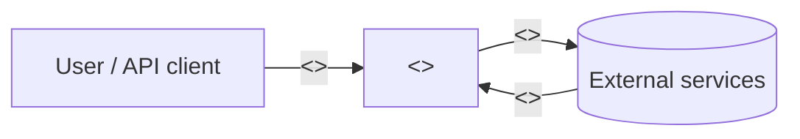
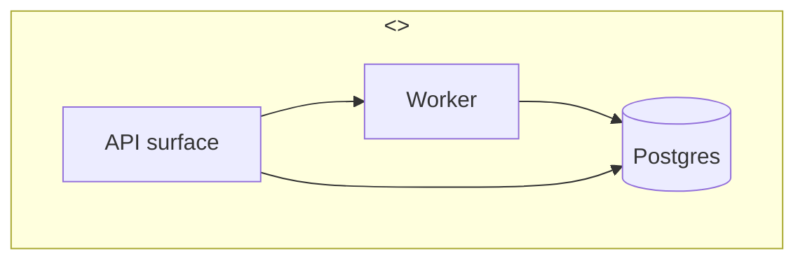
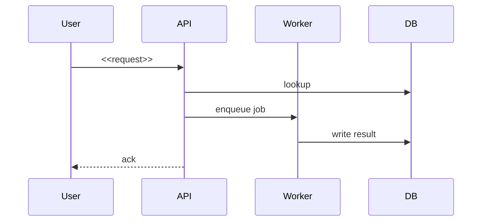
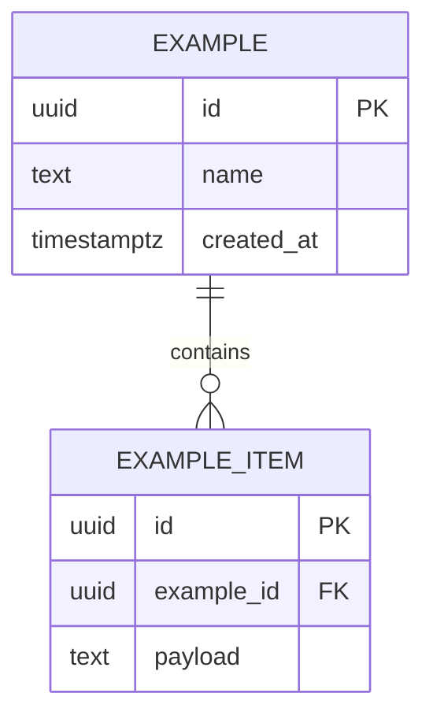

# Architecture

> <<ONE_LINE_DESCRIPTION>>

This document is the spec, not the code. When the diagrams drift from `main`,
the diagrams are wrong — fix them in the same PR.

## C4 — Context

Who talks to <<PROJECT_NAME>> and what flows in/out.

## C4 — Container

The runtime processes inside <<PROJECT_NAME>>.

## Key sequences

### <<flow_name>>

## Data model

## Conventions

See [`mermaid_conventions.md`](mermaid_conventions.md) (BP-5.2) for theme
tokens and which diagram type to use when.
